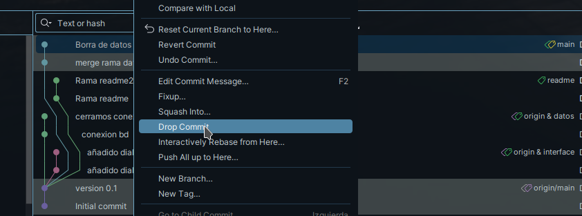

//Creamos nuestos pasos para hacer todo el merge en la rama main

1.Creamos el nuevo branch con el readme.md 
2.hacemos commit de lo necesario 
3.Eliminamos el commit innecesario de interface con drop commit

4.Nos quedaria tal que asi:

